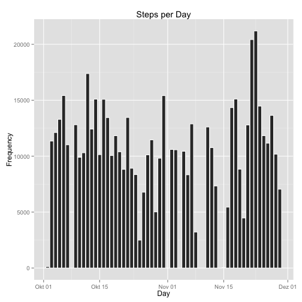
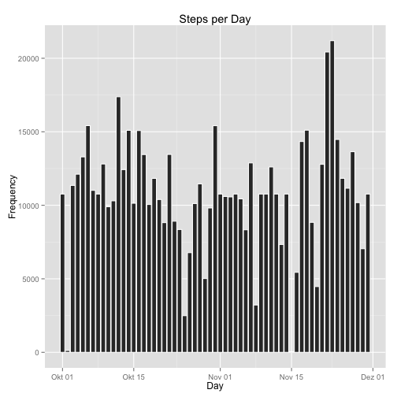

# Reproducible Research: Peer Assessment 1
## Introduction
This analysis is based on data from a personal activity monitoring device, collecting data at 5 minute intervals through out the day. The data set consists of two months of data from an anonymous individual collected during the months of October and November 2012, and includes the number of steps taken in 5 minute intervals each day. The data was loaded from [R Peng's GitHub repository](https://github.com/rdpeng/RepData_PeerAssessment1). 

## Loading and preprocessing the data
We first load the data.

```r
activity <- read.csv("/Users/bschmid1/datasciencecoursera/RepData_PeerAssessment1/activity.csv")
```


## What is mean total number of steps taken per day?
We plot a histogram displaying the steps per day.

```r
library(ggplot2)
library(scales)
activity$date <- as.Date(activity$date)
# aggregate by date and rename variables
activityPerDay <- aggregate(activity$steps, by = list(activity$date), sum)
colnames(activityPerDay) = c("date", "steps")
activityPerDay$date <- as.Date(activityPerDay$date)

# plot the aggregated data
ggplot(activityPerDay, aes(x = date, y = steps)) + geom_bar(stat = "identity", 
    color = "white") + ylab("Frequency") + xlab("Day") + ggtitle("Steps per Day")
```

```
## Warning: Removed 8 rows containing missing values (position_stack).
```

 

```r
# geom_line or geom_histogram or geom_bar (binwidth=30, colour='white')
# actdata <- activity[ , c('date', 'steps')] qplot(date, data=actdata)
```


```r
options(scipen = 100)
meanSteps <- round(mean(activityPerDay$steps, na.rm = TRUE), digits = 0)
medianSteps <- round(median(activityPerDay$steps, na.rm = TRUE), digits = 0)
```

The mean total number of steps taken per day is 1.0766 &times; 10<sup>4</sup>, and the median is 1.0765 &times; 10<sup>4</sup>. 

## What is the average daily activity pattern?
We generate a time series plot of the 5-minute interval (x-axis) and the average number of steps taken, averaged across all days (y-axis).


```r
# aggregate per interval and take the average over all days (ie the mean)
dailyactivity <- tapply(activity$steps, activity$interval, mean, na.rm = TRUE)

plot(dailyactivity, xlab = "Interval", ylab = "Activity", main = "Average Steps per Day", 
    type = "l")
```

 


```r
maxsteps = max(activity$steps, na.rm = TRUE)
m <- subset(activity, steps == max(activity$steps, na.rm = TRUE))
intervalMaxSteps <- m[1, 3]
```


The maximum number of steps is 806. The 5-minute interval, across all the days in the dataset, containing the maximum number of steps is interval number 615. 

## Imputing missing values

```r
missingvalues <- sum(is.na(activity$steps))
```

There are 2304 missing values in the variable "steps". There are no missing values in the variables "date" or "interval".

We create a new dataset by filling the missing values with the mean across all 5-minute intervals. 

```r
m <- round(mean(activity$steps, na.rm = TRUE), digits = 0)
activityNew <- activity
for (i in 1:nrow(activity)) {
    if (is.na(activity$steps[i]) == TRUE) {
        activityNew$steps[i] <- mean(activity$steps, na.rm = TRUE)
    }
}
summary(activityNew)
```

```
##      steps            date               interval   
##  Min.   :  0.0   Min.   :2012-10-01   Min.   :   0  
##  1st Qu.:  0.0   1st Qu.:2012-10-16   1st Qu.: 589  
##  Median :  0.0   Median :2012-10-31   Median :1178  
##  Mean   : 37.4   Mean   :2012-10-31   Mean   :1178  
##  3rd Qu.: 37.4   3rd Qu.:2012-11-15   3rd Qu.:1766  
##  Max.   :806.0   Max.   :2012-11-30   Max.   :2355
```

```r
# sum(is.na(activityNew)) # no NAs anymore
```

We plot the dataset with filled values. 

```r
activityNew$date <- as.Date(activityNew$date)
# aggregate by date and rename variables
activityNewPerDay <- aggregate(activityNew$steps, by = list(activity$date), 
    sum)
colnames(activityNewPerDay) <- c("date", "steps")
activityNewPerDay$date <- as.Date(activityNewPerDay$date)

# plot the filled dataset
ggplot(activityNewPerDay, aes(x = date, y = steps)) + geom_bar(stat = "identity", 
    color = "white") + ylab("Frequency") + xlab("Day") + ggtitle("Steps per Day")
```

 


```r
options(scipen = 100)
summary(activity)
```

```
##      steps            date               interval   
##  Min.   :  0.0   Min.   :2012-10-01   Min.   :   0  
##  1st Qu.:  0.0   1st Qu.:2012-10-16   1st Qu.: 589  
##  Median :  0.0   Median :2012-10-31   Median :1178  
##  Mean   : 37.4   Mean   :2012-10-31   Mean   :1178  
##  3rd Qu.: 12.0   3rd Qu.:2012-11-15   3rd Qu.:1766  
##  Max.   :806.0   Max.   :2012-11-30   Max.   :2355  
##  NA's   :2304
```

```r
summary(activityNew)
```

```
##      steps            date               interval   
##  Min.   :  0.0   Min.   :2012-10-01   Min.   :   0  
##  1st Qu.:  0.0   1st Qu.:2012-10-16   1st Qu.: 589  
##  Median :  0.0   Median :2012-10-31   Median :1178  
##  Mean   : 37.4   Mean   :2012-10-31   Mean   :1178  
##  3rd Qu.: 37.4   3rd Qu.:2012-11-15   3rd Qu.:1766  
##  Max.   :806.0   Max.   :2012-11-30   Max.   :2355
```

```r
meanSteps <- round(mean(activity$steps, na.rm = TRUE), digits = 0)
medianSteps <- round(median(activity$steps, na.rm = TRUE), digits = 0)
meanStepsNew <- round(mean(activityNew$steps, na.rm = TRUE), digits = 0)
medianStepsNew <- round(median(activityNew$steps, na.rm = TRUE), digits = 0)
totalSteps <- round(sum(activity$steps, na.rm = TRUE), digits = 0)
totalStepsNew <- round(sum(activityNew$steps, na.rm = TRUE), digits = 0)
diff <- totalStepsNew - totalSteps
```

On this basis the mean and median steps per day stay the same (all rounded to integers): 
- original data: mean = 37, median = 0 (while there is some increase in the 3rd quartile of the filled data)
- interpolated data: mean = 37, median = 0

Overall, the total number of steps is increased by 656738 - 570608 = 86130. 

## Are there differences in activity patterns between weekdays and weekends?

We use the dataset with the filled-in missing values for this part, and create a new factor variable in the dataset with two levels – “weekday” and “weekend” indicating whether a given date is a weekday or weekend day.


```r
# assign category of day to each date
activityNew$daycat <- ifelse((weekdays(as.Date(activityNew$date)) == "Samstag" | 
    weekdays(as.Date(activityNew$date)) == "Sonntag"), c("weekend"), c("weekday"))
activityNew$weekday <- factor(activityNew$daycat, levels = c("weekday", "weekend"))
summary(activityNew$weekday)
```

```
## weekday weekend 
##   12960    4608
```

We create a plot comparing the weekday and the weekend activity, based on the time series of the 5-minute interval (x-axis) and the average number of steps taken, averaged across all weekday days or weekend days (y-axis).


```r
# aggregate per interval and take the average over all days (ie the mean)
weekendactivity <- subset(activityNew, daycat == "weekend")
weekendactivityavg <- tapply(weekendactivity$steps, weekendactivity$interval, 
    mean, na.rm = TRUE)

weekdayactivity <- subset(activityNew, daycat == "weekday")
weekdayactivityavg <- tapply(weekdayactivity$steps, weekdayactivity$interval, 
    mean, na.rm = TRUE)

par(mfrow = c(2, 1))  #two figures, vertical
plot(weekdayactivityavg, xlab = "Interval", ylab = "Activity", main = "Activity on Weekdays", 
    type = "l")
plot(weekendactivityavg, xlab = "Interval", ylab = "Activity", main = "Activity on Weekends", 
    type = "l")
```

 

Some observations:
- Activtity in terms of steps taken is wider spread and much higher on weekends than on weekdays.
- Activity rises earlier on weekdays, starting around interval 60, i.e. from 5 o'clock in the morning.
- Both on weekdays and weekends there is some sharp rise of activity around interval 100, i.e. around 8.30 o'clock.
- On weekdays activity peaks are lower and less frequent at later intervals than at weekends. 


```r
100 * 5/60
```

```
## [1] 8.333
```

